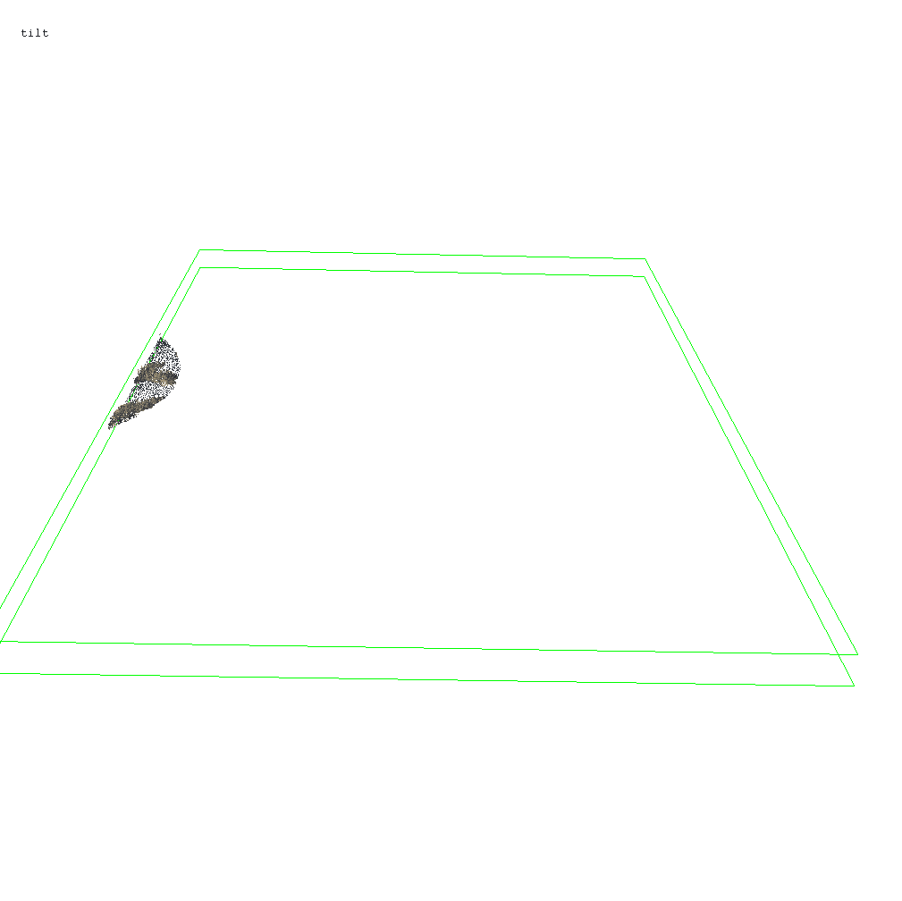

# Point-Cloud

point cloud processing workflows using LAStools

<a href="http://rsl02.cfans.umn.edu/mission/" target="_blank">  </a>

Trevor2.0 - for use on pix4d (classified) UAS point clouds
potreeviewers - for fast webGL point cloud visualization


Samples
http://rsl02.cfans.umn.edu/mission/

## Getting Started

These are workflows that LAStools command line to validate and derive products from 3D point clouds of various sources. 

### Prerequisites

Download LAStools latest here http://lastools.org

```
Give examples
```

## Acknowledgments

* Martin Isenburg, http://LAStools.org
* Markus Schütz, http://Potree.org
* Data from MNGEO, USGS National Map, UMN UAS
