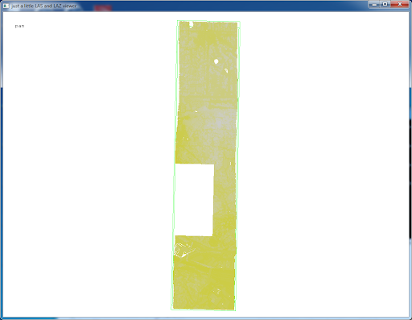
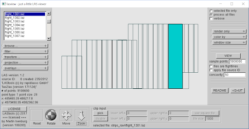
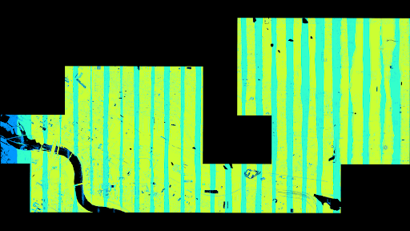
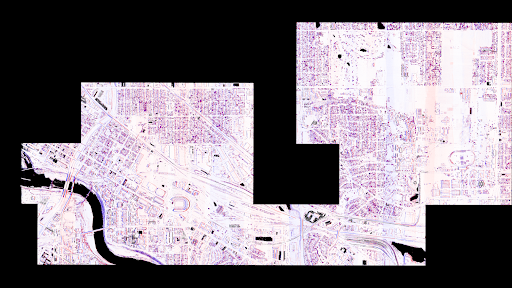
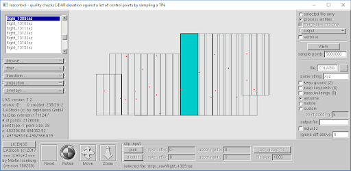
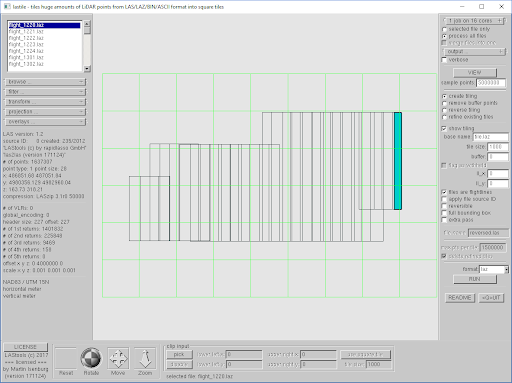
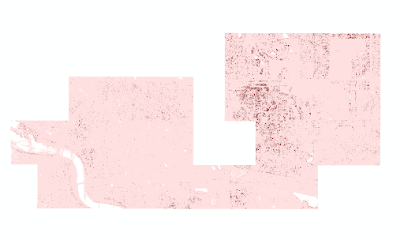

# Lidar Quality Checking
###### Adapted from [April 20, 2013](http://rapidlasso.com/2013/04/20/tutorial-quality-checking/) by [Martin Isenburg](http://rapidlasso.com/lastools/)

```
Tools: LASview, LASinfo, LASoverlap, LAScontrol, LAStile, LASboundary, LASgrid
```

### Getting Started 

This is a guide for inspecting a lidar point cloud in a 3D viewer, assessing the quality of the lidar dataset, and preparing the point cloud for further processing. This guide uses the LAStools suite of lidar processing tools. We will access LAStools through a command line window to call commands for viewing, inspecting, validating, and manipulating the point cloud. LAStools is not free software, please use the licensed version provided. The non-licensed version will still run the tools successfully but will introduce small errors into any outputs created. To get started, download the LAStools zip folder provided and extract the file to the root C: directory. All of the tools are located in the ‘bin’ folder and the data is located in the ‘strips_raw’ folder. For simplicity, we will work in the ‘.\lastools\bin’ directory, so open a DOS command line window and change the directory to the LAStools bin directory with the following command. 
 
```
cd c:\lastools\bin
```
This folder contains all the tools that we will be using and many more. Each tool is an executable file that can be called by opening the EXE file from the file explorer or typing the name of the file in the command window. This exercise focuses on using the command window to run the tools. The data we will be using is in a folder titled ‘strips_raw’ folder. There are 27 LAZ flight lines provided. We will walk through the steps to assess the data, merge the overlapping flight lines, and then spatially divide the point cloud into tiles for subsequent processing.  

In this exercise, we will check that the lidar collection meets certain specifications, such as:

* Point density greater than 8 points/sq meter
* Vertical RMSE less than 15 cm
* Complete and consistent coverage of the UMN campus 

Let’s get started by visualizing the point cloud. 

### LASview 

The first task is to visually inspect the point cloud from one flight line. LASview is used to display the 3D point cloud many times throughout this exercise and is the easiest way to confirm that a tool has successfully achieved the intended result. The viewer itself is very powerful for filtering and manipulating the point cloud but it takes time and practice to master the interface functions.   The command below will launch the viewer in a new window and display the point cloud. 

```
Lasview -i strips_raw\flight_1222.laz
```

You can manipulate the point cloud by clicking and dragging in the window. Press the spacebar to change between “Pan”, “Translate”, “Zoom”, and “Tilt” modes of steering. Right-click in the window to bring up the more visualization options. Change the color scheme to “color by flightline.” Since this is one flight line, all the points should be the same color. You can also use the “c” hot-key to toggle through the coloring options. There are a few other visualization options. Coloring points by return turns single returns yellow, first of many returns red, and last of many returns blue. Pressing the “=” key increases the point size and the “-” key decreases the point size. Pressing the “t” key triangulates the points into a TIN used for surface modelling. “h” changes the shading of the TIN. “T” will remove the triangles.

 

Now start lasview with the GUI either by double-clicking the executable and using the ‘browse…’ button on the left panel to load the flight strips or by simply adding ‘-gui’ to the command line. 
```
Lasview -i strips_raw\*.laz -gui
```
 


In the GUI above, you can see some key metadata information for the point clouds. The files x, y, and z scaling factors are set to 0.001 which means that points are stored with millimeter resolution. Because airborne LiDAR is far from being that accurate we will later change the scaling factor to a more appropriate centimeter resolution.

### LASinfo

Next, let’s run lasinfo on one of the strips and compute the point density with the ‘-compute_density’ flag.
```
Lasinfo -i strips_raw/flight_1314.laz -compute_density
```
This produces a standard output with information about the LAZ point cloud. Add ‘-otxt’ to the command above to write the report to a txt file.

```
reporting all LAS header entries:
  file signature:             'LASF'
  file source ID:             0
  global_encoding:            0
  project ID GUID data 1-4:   00000000-0000-0000-0000-000000000000
  version major.minor:        1.2
  system identifier:          'LAStools (c) by rapidlasso GmbH'
  generating software:        'las2las (version 171124)'
  file creation day/year:     235/2012
  header size:                227
  offset to point data:       503
  number var. length records: 2
  point data format:          1
  point data record length:   28
  number of point records:    7658569
  number of points by return: 6744471 893068 20752 278 0
  scale factor x y z:         0.001 0.001 0.001
  offset x y z:               0 4000000 0
  min x y z:                  481882.600 4979498.700 172.750
  max x y z:                  482673.850 4982104.270 316.780
variable length header record 1 of 2:
  reserved             43707
  user ID              'LASF_Projection'
  record ID            34735
  length after header  40
  description          'by LAStools of rapidlasso GmbH'
    GeoKeyDirectoryTag version 1.1.0 number of keys 4
      key 1024 tiff_tag_location 0 count 1 value_offset 1 - GTModelTypeGeoKey: ModelTypeProjected
      key 3072 tiff_tag_location 0 count 1 value_offset 26915 - ProjectedCSTypeGeoKey: NAD83 / UTM 15N
      key 3076 tiff_tag_location 0 count 1 value_offset 9001 - ProjLinearUnitsGeoKey: Linear_Meter
      key 4099 tiff_tag_location 0 count 1 value_offset 9001 - VerticalUnitsGeoKey: Linear_Meter
      variable length header record 2 of 2:
  reserved             0
  user ID              'FugroHorizons'
  record ID            0
  length after header  128
  description          'FHZNInfo'
LASzip compression (version 3.1r0 c2 50000): POINT10 2 GPSTIME11 2
reporting minimum and maximum for all LAS point record entries ...
  X           481882600  482673850
  Y           979498700  982104270
  Z              172750     316780
  intensity          39        400
  return_number       1          4
  number_of_returns   1          4
  edge_of_flight_line 0          1
  scan_direction_flag 1          1
  classification      0          0
  scan_angle_rank   -30         30
  user_data           0          3
  point_source_ID  1314       1314
  gps_time 469069.044453 469111.415373
__WARNING: there is coordinate resolution fluff (x10) in X__
number of first returns:        6744471
number of intermediate returns: 2297
number of last returns:         7488988
number of single returns:       7284357
covered area in square meters/kilometers: 1914696/1.91
__point density: all returns 4.00 last only 3.91 (per square meter)__
      spacing: all returns 0.50 last only 0.51 (in meters)
overview over number of returns of given pulse: 7284357 367376 6717 119 0 0 0
histogram of classification of points:
         __7658569  never classified (0)__

```

There are many summary statistics included in this report such as the minimum and maximum intensity, return number, classification, scan angle rank, point source ID, and point density. This point cloud is not yet classified otherwise it would report how many points are classified by value. There are also automatic WARNING messages that will report common discrepancies in point cloud data such as resolution fluff. The point density is calculated to be 4 points per square meter on all returns. Recall that is only one flight-line.


Now run lasinfo on all of the LAZ files merged into one.
```
Lasinfo -i strips_raw/*.laz -merged -compute_density -otxt -odir products -o info.txt
```
### LASoverlap

Before processing, we must check the alignment and overlap of the flightlines. Let’s use the ‘lasoverlap’ tool. 
```
Lasoverlap -i strips_raw\*.laz -files_are_flightlines -step 1 -max_diff 1 -odir products -o qualitycheck.png -opng -utm 15N -nad83
```
This command will output an overlap image and z-difference image. The ‘-step’ flag indicates the grid cell size used (in meters). The ‘-max_diff’ flag sets the tolerance for difference between two flightlines. The ‘-files_are_flightlines’ flag identifies that each file corresponds to one flightline. ‘-odir’ is the name of output directory were the generated files will be stored. “-o strip qualitycheck.png’ sets the output filename. Finally, we add the spatial reference information with ‘-utm 15N’.

 
 

You can identify systematic issues with lidar collect from the colors in these images. Voids in the ‘overlap’ image indicate areas were no points were collected. Voids that are clearly due to the flight line pattern (not due to water) means that there were serious problems with the collection. The colors correspond to number of overlapping flight lines for each grid cell (Blue = 1, Cyan = 2, Yellow = 3). Can you determine what percentage lateral overlap was used in this flight pattern just by looking at the image? 


In the ‘difference’ image, highly saturated blue or red in open areas (not trees/buildings) indicates vertical misalignment between flightlines. Small misalignment is common due to the positional accuracy of the data which we will quantify in the next step using high-accuracy GPS control points.

LAScontrol
To quantify the vertical accuracy of the lidar point cloud, we will compare the LAZ flight lines to a set of 21 high-accuracy ground control points. Copy the text below into a spreadsheet and save it as a csv file in ‘strips_raw\controlpoints.csv’ 

Easting|Northing|Z
-------|--------|-
481992.41|4980699.45|252.84
482430.30|4979565.85|250.86
482297.95|4982025.85|261.49
482291.65|4980366.51|252.13
485334.45|4981502.46|300.59
486109.90|4982103.27|293.56
486122.46|4980987.83|281.39
485699.02|4980256.74|274.56
483329.83|4980597.97|261.17
484786.37|4980550.45|272.10
480757.77|4980218.92|249.07
480952.50|4980169.18|229.75
481380.18|4980523.51|255.94
481437.94|4980187.80|257.01
481691.68|4981449.61|255.17
480094.94|4980525.85|250.09
481008.03|4981993.53|255.36
484746.46|4982077.37|298.52
484094.48|4981317.88|268.17
484598.68|4980278.70|271.02
486427.81|4980586.41|277.84

Run the lascontrol command to assess the vertical accuracy of the point cloud compared to the control points. ‘-cp’ designates the control points file. ‘-cp_out’ is the report output. ‘-v’ stands for ‘verbose’ which provides additional information in the command window.
```
Lascontrol -i strips_raw\*.laz -cp strips_raw\controlpoints.csv -cp_out products\report.txt -odir products -v
```
 

The standard output will produce an error report with average absolute error, root mean square error, standard deviation of the errors, average error, and skew. It will also produce a txt file report that contains a copy of the original controls points with two values prefixed. The values added are the computed z-value at the control point and calculated z-difference in meters for each point. The contracted vertical accuracy of the lidar collection was 15 cm Z-RMSE. Does the point cloud meet this accuracy standard? Plot the distribution of z-error. Are there any outliers? What might be the cause of z-error?


### LAStile
Next we will convert the flightline strips into a tiled LAZ dataset. The “lastile” command is the right tool for the job. We will set the tile size to 1000 meters with a 50 m buffer around each tile. It is critically important to have buffered tiles for any classification or surface model processing. Buffered points are given the “withheld” flag to be easily dropped later. We also rescale the coordinate resolution to a more appropriate centimeter resolution. The output name is the root name of the tiles. 
```
Lastile -i strips_raw\*.laz -tile_size 1000 -buffer 50 -flag_as_withheld -rescale 0.01 0.01 0.01 -odir tiles -o UMN.laz
```
 
The GUI version will look like this and will give you an idea of how many tiles will be produced. It can be useful for finding the optimal tile arrangement.

### LASboundary
Now we can create a tile index of the newly tiled laz files using lasboundary. Lasboundary creates a shapefile around the extent of the points. With the flag -use_tile_bb, the polygon created will be of the bounding box containing all points. “-labels” gives each polygon an attribute with the file name. The “-overview” flag will merge the individual polygons into one merged shapefile. Note to not use the “-merged” flag here as that would return one large bounding box around all the points. Lasboundary has other useful applications that we will return to later.
```
Lasboundary -i tiles\*.laz -use_tile_bb -overview -labels -odir products -o tile_index.shp -oshp -utm 15N -nad83
```

Open the shapefile in ArcMap to check the results. Now our properly tiled and indexed dataset is ready for further processing that can make use of the multi-core functionality in LAStools.


### LASgrid 
The easiest way to create a map from the point cloud is using lasgrid. This tools creates a raster image of a number of attributes from the point cloud files including
* Elevation
* Intensity
* Point density
* Number of returns
* Classification

The following commands will use multiple cores to process the LAZ tiles in parallel. LAStools is able to loop through a list of files and process multiple files simultaneously on separate cores. 


Run the example scripts below to process the tiles in parallel to create BIL format rasters then merge into a single TIF for ‘point density’ and ‘number of returns.’ Once complete, open these in ArcMap to verify the results. 
```
Lasgrid -i tiles\*.laz -counter -step 1 -odir tiles -obil -cores 7
Lasgrid -i tiles\*.bil -merged -o pointDensity.tif -odir products -otif -utm 15N -nad83

Lasgrid -i tiles\*.laz -number_returns -step 1 -odir tiles -obil -cores 7
Lasgrid -i tiles\*.bil -merged -o numberReturns.tif -odir products -otif -utm 15N -nad83
```

Write a script to rasterize the elevation and intensity on the tiles using lasgrid then merge.

 
Point density raster
Darker = Greater

 
Number of returns raster
Darker = greater

We’ve now completed a suite of validation checks on the lidar point cloud and created a spatially tiled LAZ dataset from flight lines. The next exercise will use the tiled point cloud dataset for classification, DEM creation, normalization, and feature extraction. 

